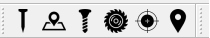
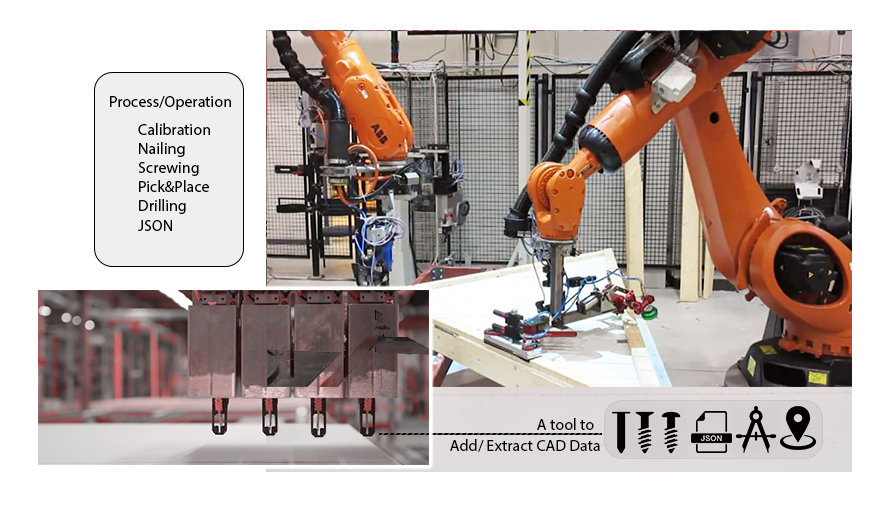
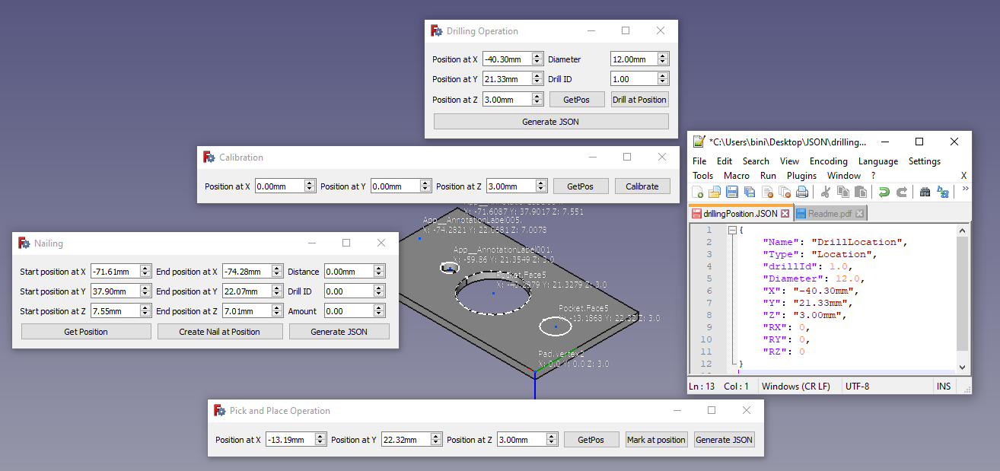

# Plug&Produce-FreeCADMacro (Robotized prefabricated house production) - ## Python scripts ##

This is a Macro for FreeCAD that implements a set of add-on tools that allows customization of prefabricated wall in robotized house production. This tool extracts CAD (Wall Design) data as input to a configurable multi-agent system. It has two forms: processing of CAD drawing by running Python scripts within FreeCAD application and passing on the data from the FreeCAD application to a configurable multi-agent system using JSON file format. The tool defines Holes, Nails, Screws and Pick&Place processes in a plug and produce workflow.It also provides a virtual object calibration. Process defination including variable names for positions and properties can be stored in a data file (JSON) for further use. 

## Getting Started

IMPORTANT: Satisfy certain constraints to use plug and produce macro tools. 
				   The tools are still under development and will be updated regularly. 
				   These updates will focus on easing the following conditions.
		============================================================================

				1. You need to name your design to a name called "NewDesign".
				   In this version (V.01), Use the design provided with this package. 
				2. You must design your sketch on an XY plane.
				3. A drawing needs to be correctly constrained. 
				4. Use calibration point close to the origin of a sketch.
				4. Modify Json directories to a desired location.

		1. DEFINITION
		---------------
		Macros are Python scripts, which means they are text files that can be written and edited with a text editor.
		While Python scripts normally have the .py extension, FreeCAD macros should have the .FCMacro extension. This
		also apply to the Plug and Produce Macro tools.

		2. INSTALLATION
		----------------
		Extract and add all files into FreeCAD macro directory. The directory can be accessed by Macro tab located
		through preference menu bar. This will depend on FreeCAD version. Extract the zip file called "icons" and 
		assign icons to corrsponding macros/operations. Now you're ready to go!!!

		3. TRIAL
		--------
		For simple demonstration, use already made design inside this package.  

		
		Thank you for reading me!  
		
## Author

 **Solomon Gugsa** 
## Co-Author 

  **Mashiur Rahaman**

## Version History
* 0.1
    * Initial Release
    * Version 02 comming on Nov 29/2021

## License

This project is licensed under -----

## Acknowledgments
Special thanks to **Prof Fredrik Danielsson** and **Research engineer Anders Nillson** University West, Sweden, 

## Open Source License Acknowledgement
* Macro FCInfoToMouse
	* Mouse location functionality used under GNU General Public License
